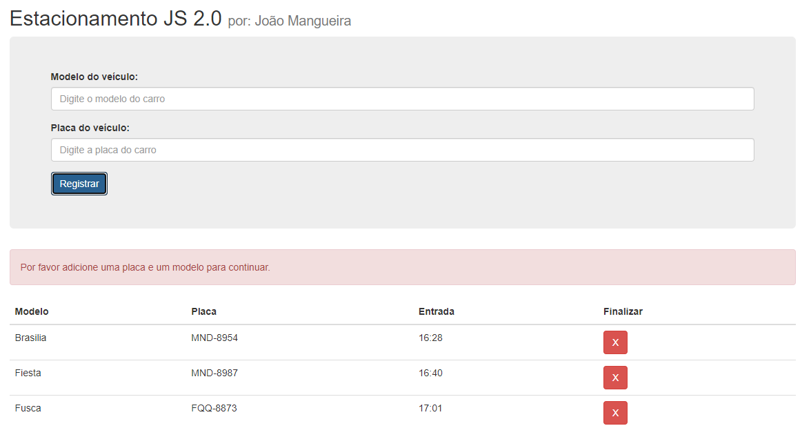
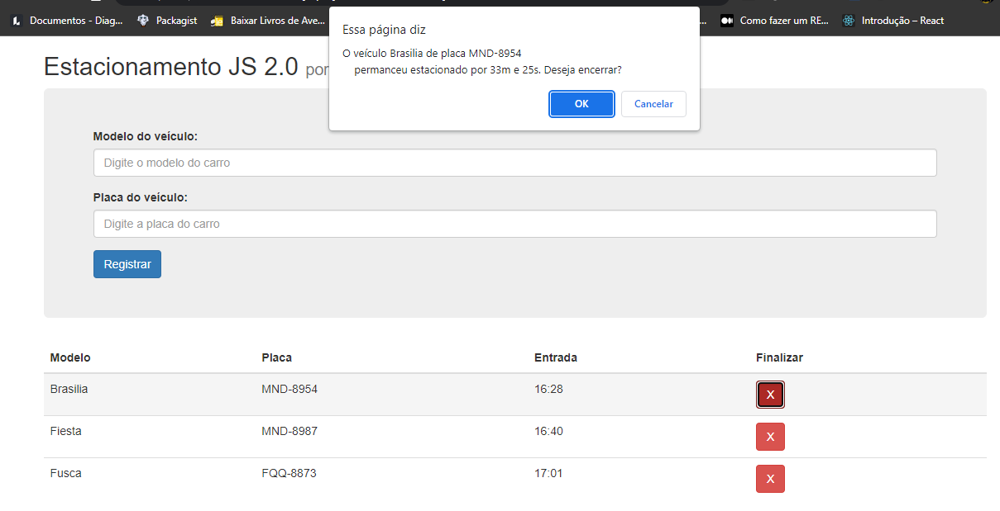

  <a href="#-projeto">Projeto</a>&nbsp;&nbsp;&nbsp;|&nbsp;&nbsp;&nbsp; 
  <a href="#-como-rodar">Como rodar</a>&nbsp;&nbsp;&nbsp;|&nbsp;&nbsp;&nbsp;
  <a href="#-como-contribuir">Como contribuir</a>&nbsp;&nbsp;&nbsp;
 

 

# Sistema de estacionamento 2.0

## 🚀 Tecnologias

Esse projeto foi desenvolvido com as seguintes tecnologias:

- [CSS3](https://developer.mozilla.org/pt-BR/docs/Web/CSS)
- [HTML5](https://developer.mozilla.org/pt-BR/docs/Web/HTML/HTML5)
- [JavaScript](https://developer.mozilla.org/pt-BR/docs/Web/JavaScript)

## 💻 Projeto

Projeto em JS para cadastrar carros em um estacionamento.

[Primeiro projeto](https://github.com/jamangueira7/projeto-estacionamento-js)
Projeto inspirado na video aula do canal [Código de Estagiário](https://www.youtube.com/watch?v=SjH5132XHlo).

  

  

  

## 🚀 Como Rodar

- Clone o projeto.
- Abra o arquivo index.html no seu navegador.

## 🤔 Como contribuir

- Faça um fork desse repositório;
- Cria uma branch com a sua feature: `git checkout -b minha-feature`;
- Faça commit das suas alterações: `git commit -m 'feat: Minha nova feature'`;
- Faça push para a sua branch: `git push origin minha-feature`.

Depois que o merge da sua pull request for feito, você pode deletar a sua branch.

